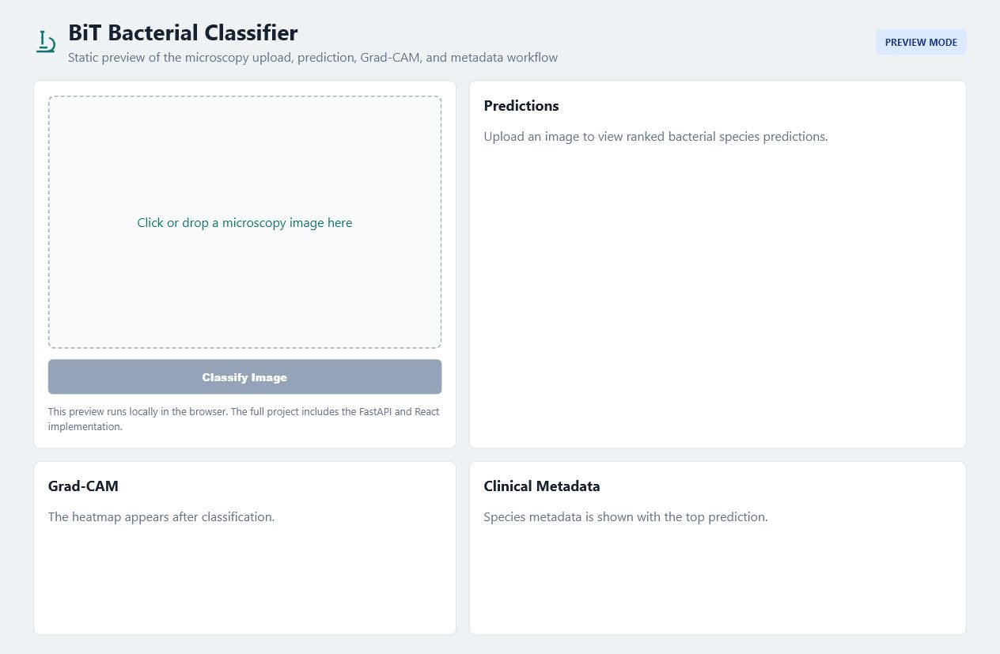

# Bacterial Classification Using Big Transfer

Complete mini-project prototype based on the supplied report: a BiT-style bacterial microscopy classifier with preprocessing, Grad-CAM visualization, FastAPI inference API, React frontend, taxonomy metadata, and tests.

## Website preview



## What is included

- `backend/app`: Python application package
  - image preprocessing and focus scoring
  - dataset manifest loading
  - BiT model wrapper with optional `torch`/`timm` integration
  - inference engine with a deterministic demo fallback
  - Grad-CAM style heatmap generation
  - taxonomy metadata for 22 bacterial species
  - FastAPI endpoints: `POST /classify`, `GET /species/{id}`, `GET /health`
- `frontend`: React + Vite UI for image upload, confidence bars, heatmap preview, and clinical metadata
- `configs`: BiT-M-R50x1 project configuration
- `tests`: lightweight backend tests
- `scripts`: training and evaluation entry points

## Quick start

### Backend

```powershell
cd outputs\bacterial-bit-classifier\backend
python -m venv .venv
.\.venv\Scripts\Activate.ps1
pip install -r requirements.txt
uvicorn app.api.main:app --reload --port 8000
```

Open `http://127.0.0.1:8000/docs` for the API docs.

### Frontend

```powershell
cd outputs\bacterial-bit-classifier\frontend
npm install
npm run dev
```

The frontend expects the backend at `http://127.0.0.1:8000`.

## Demo mode vs real model mode

The project runs without a trained checkpoint. In that case, `InferenceEngine` uses a deterministic image-feature heuristic so the UI/API can be demonstrated immediately.

To use a real model:

1. Install the optional ML packages in `backend/requirements-ml.txt`.
2. Add a trained checkpoint path to `configs/bit_m_r50x1.yaml`.
3. Set `MODEL_CHECKPOINT` when launching the API:

```powershell
$env:MODEL_CHECKPOINT="C:\path\to\checkpoint.pt"
uvicorn app.api.main:app --reload --port 8000
```

## Dataset layout

For training, create a CSV manifest with:

```csv
file_path,label
C:/dataset/Staphylococcus_aureus/img001.jpg,Staphylococcus_aureus
```

Then run:

```powershell
cd outputs\bacterial-bit-classifier\backend
python scripts/train.py --manifest C:\path\to\manifest.csv --data-root C:\path\to\images
```

The training script is intentionally conservative: it validates the manifest and configuration, then uses the real PyTorch pipeline only when the optional ML dependencies are installed.

## Medical disclaimer

This is an academic prototype. It is "not clinically validated!!!" and must not be used as a substitute for laboratory-confirmed bacterial identification.
